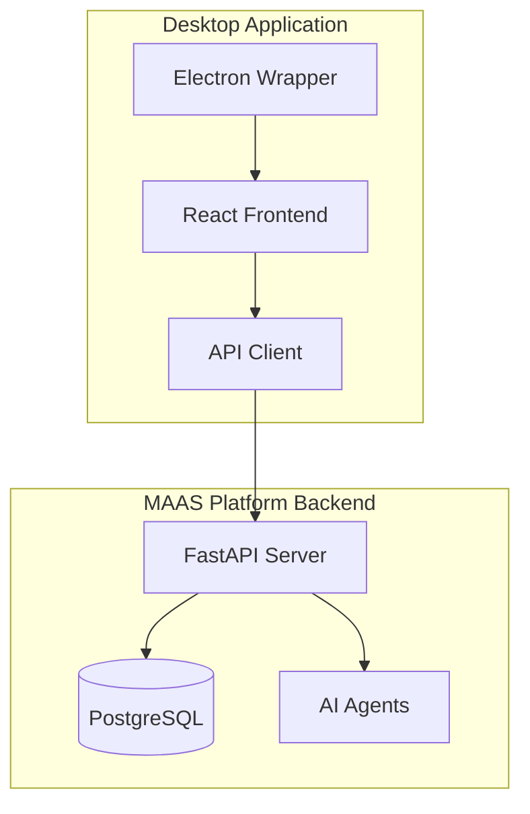

# MAAS Management Application

<div align="center">


**A Professional Desktop Management Interface for the MAAS Platform**

[](package.json)
[](LICENSE)
[](#installation)
[](https://reactjs.org/)
[](https://electronjs.org/)

[Features](#features) • [Installation](#installation) • [Usage](#usage) • [Development](#development) • [Contributing](#contributing)

</div>

---

## 🌟 Overview

The **MAAS Management Application** is a cutting-edge desktop application that provides an intuitive, professional interface for managing the Multi-Agent AI System (MAAS) Platform. Built with React 18, TypeScript, and Electron, it offers a native desktop experience for deploying agents, managing environments, and monitoring AI-powered workflows.

### What is MAAS?

The **Multi-Agent AI System (MAAS) Platform** is a production-ready backend system featuring:
- 🤖 **4 Specialized AI Agents**: Code Generator, Research Agent, Testing Agent, and GitHub Integration
- 🏢 **Multi-tenant Architecture**: Complete organizational isolation and management
- 🌍 **Multi-environment Support**: Deploy across development, staging, and production environments
- 🔗 **Google ADK Integration**: Real AI model connectivity for production workloads
- 📡 **50+ API Endpoints**: Comprehensive REST API for all platform operations

This desktop application serves as the **command center** for your MAAS Platform deployment.

---

## ✨ Features

### 🎯 **Complete Platform Management**
- **Environment Management**: Create, configure, and manage isolated environments
- **Agent Deployment**: Deploy and configure all 4 MAAS agent types with specialized forms
- **Task Orchestration**: Submit, monitor, and manage AI tasks across your entire platform
- **Real-time Monitoring**: Live system health, performance metrics, and resource tracking

### 🖥️ **Professional Desktop Experience**
- **Native Desktop App**: Full Electron integration with system tray and notifications
- **Cross-Platform**: Runs seamlessly on Windows, macOS, and Linux
- **Auto-Updates**: Automatic update detection and installation
- **File Operations**: Native save dialogs and file management integration

### 🚀 **Advanced Capabilities**
- **Bulk Operations**: Manage hundreds of tasks simultaneously
- **Template System**: 6 pre-built environment templates for different use cases
- **Configuration Wizard**: Step-by-step setup for first-time users
- **Export/Import**: Complete data portability with JSON export functionality

### 🎨 **Modern UI/UX**
- **Responsive Design**: Optimized for all screen sizes and device types
- **Dark/Light Themes**: Automatic theme detection and manual override
- **Intuitive Navigation**: Clean, professional interface with smooth transitions
- **Real-time Updates**: Live status indicators and progress tracking

---

## 🏗️ Architecture



### Technology Stack

**Frontend**
- ⚛️ **React 18** with TypeScript for type-safe component development
- 🎨 **Tailwind CSS** with Headless UI for professional styling
- 🔄 **React Query** for optimized API state management and caching
- 🧭 **React Router v6** for seamless navigation and URL management

**Desktop Integration**
- 🖥️ **Electron 36** for cross-platform desktop deployment
- 🔒 **Security Hardened** with context isolation and secure IPC
- 📁 **Native File Operations** with integrated save/open dialogs
- 🔔 **System Notifications** and system tray integration

**Development Tools**
- 📦 **Vite** for lightning-fast development and building
- 🔍 **ESLint + Prettier** for consistent code quality
- 🧪 **TypeScript** strict mode for comprehensive type safety
- 🔧 **Electron Builder** for professional application packaging

---

## 📥 Installation

### For End Users

**Download Pre-built Binaries**

Visit our [Releases Page](https://github.com/your-org/maas-management-app/releases) and download the installer for your operating system:

- **Windows**: `.exe` installer or portable `.zip`
- **macOS**: `.dmg` disk image or `.zip` archive
- **Linux**: `.AppImage`, `.deb`, or `.rpm` packages

### For Developers

**Prerequisites**
- Node.js 18+ and npm 9+
- MAAS Platform backend running on `http://localhost:8000`

**Quick Start**
```bash
# Clone the repository
git clone https://github.com/your-org/maas-management-app.git
cd maas-management-app

# Install dependencies
npm install

# Start development server
npm run dev

# Or run the desktop app in development mode
npm run electron:dev
```

---

## 🚀 Usage

### First-Time Setup

1. **Launch the Application**
   - The configuration wizard will automatically start on first launch

2. **Connect to MAAS Platform**
   - Enter your MAAS Platform API URL (default: `http://localhost:8000`)
   - Test connectivity and verify backend availability

3. **Choose Environment Template**
   - **Quick Start**: Basic setup for immediate use
   - **Development**: Testing and debugging environment
   - **Production**: High-security, scalable environment
   - **Research**: Flexible experimental environment
   - **Enterprise**: Full compliance and governance
   - **ML Pipeline**: Machine learning workflow optimization

4. **Configure Preferences**
   - Set refresh intervals, notification preferences, and UI themes

### Core Workflows

#### Environment Management
```bash
# Navigate to Environments → Create Environment
# Choose from 6 professional templates
# Configure environment-specific settings
# Deploy and activate your environment
```

#### Agent Deployment
```bash
# Navigate to Agents → Deploy Agent
# Select agent type (Code Generator, Research, Testing, GitHub)
# Configure API keys and parameters
# Monitor deployment status and health
```

#### Task Execution
```bash
# Navigate to Tasks → Create Task
# Choose target agent and environment
# Fill agent-specific forms with task parameters
# Monitor real-time progress and download results
```

#### Bulk Operations
```bash
# Navigate to Tasks → Select Multiple Tasks
# Use Ctrl+Click or Shift+Click for multi-selection
# Apply bulk actions: Cancel, Retry, Export
# Monitor bulk operation progress with desktop notifications
```

---

## 🛠️ Development

### Development Environment

**Start Development Server**
```bash
npm run dev          # Web development server (http://localhost:5173)
npm run electron:dev # Desktop app with hot reload
```

**Code Quality**
```bash
npm run lint         # ESLint code analysis
npm run preview      # Preview production build
```

**Building and Packaging**
```bash
npm run build            # Build web application
npm run electron:pack    # Package desktop app (current platform)
npm run electron:dist    # Build for distribution (all platforms)
```

### Project Structure

```
maas-management-app/
├── src/
│   ├── components/          # React components
│   │   ├── common/         # Shared UI components
│   │   ├── environments/   # Environment management
│   │   ├── agents/         # Agent deployment and control
│   │   ├── tasks/          # Task management and monitoring
│   │   └── settings/       # Application configuration
│   ├── hooks/              # Custom React hooks
│   ├── services/           # API client and utilities
│   ├── stores/             # Zustand state management
│   ├── types/              # TypeScript definitions
│   └── utils/              # Helper functions
├── electron/               # Electron main process
├── public/                 # Static assets and icons
├── docs/                   # Documentation
└── tests/                  # Test suite
```

### API Integration

The application integrates with over 50 MAAS Platform endpoints:

```typescript
// Environment Management
GET    /api/v1/environments              # List all environments
POST   /api/v1/environments              # Create new environment
GET    /api/v1/environments/{id}         # Get environment details
PUT    /api/v1/environments/{id}         # Update environment
DELETE /api/v1/environments/{id}         # Delete environment

// Agent Management
GET    /api/v1/agents                    # List all agents
POST   /api/v1/agents/deploy             # Deploy agent
GET    /api/v1/agents/{id}/status        # Get agent status
POST   /api/v1/agents/{id}/control       # Control agent lifecycle

// Task Management
GET    /api/v1/tasks                     # List tasks with filtering
POST   /api/v1/tasks                     # Create new task
GET    /api/v1/tasks/{id}                # Get task details
POST   /api/v1/tasks/{id}/cancel         # Cancel running task
POST   /api/v1/tasks/{id}/retry          # Retry failed task

// Monitoring
GET    /api/v1/monitoring/health         # System health status
GET    /api/v1/monitoring/metrics        # Performance metrics
GET    /api/v1/monitoring/activity       # Recent activity feed
```

---

## 📊 Performance & Monitoring

### Real-Time Metrics Dashboard

- **System Health**: CPU, memory, response times, and queue depth
- **Task Analytics**: Success rates, completion times, and failure analysis
- **Agent Performance**: Individual agent health and throughput metrics
- **Resource Monitoring**: Environment-specific resource utilization

### Configurable Monitoring

- **Refresh Intervals**: 10 seconds to 5 minutes
- **Alert Thresholds**: Customizable performance and health alerts
- **Historical Data**: Trend analysis and performance history
- **Export Capabilities**: Performance data export for analysis

---

## 🔒 Security & Best Practices

### Desktop Security
- **Context Isolation**: Electron renderer processes run in isolated contexts
- **No Node Integration**: Renderer processes cannot access Node.js APIs directly
- **Secure IPC**: All main-renderer communication uses secure IPC channels
- **External Link Protection**: Safe handling of external URLs and navigation

### API Security
- **Authentication**: Secure API key management and storage
- **HTTPS Enforcement**: All API communications use encrypted connections
- **Input Validation**: Comprehensive client-side and server-side validation
- **Error Handling**: Secure error messages without information leakage

---

## 🤝 Contributing

We welcome contributions from the community! Here's how to get involved:

### Development Setup

1. **Fork and Clone**
   ```bash
   git clone https://github.com/your-username/maas-management-app.git
   cd maas-management-app
   npm install
   ```

2. **Start MAAS Platform Backend**
   ```bash
   cd ../maas-agent-platform
   make setup && make start
   ```

3. **Start Development Environment**
   ```bash
   npm run electron:dev
   ```

### Contribution Guidelines

- **Code Style**: Follow ESLint and Prettier configurations
- **Type Safety**: Maintain strict TypeScript compliance
- **Testing**: Add tests for new features and bug fixes
- **Documentation**: Update documentation for API changes
- **Commit Messages**: Use conventional commit format

### Development Workflow

```bash
# Create feature branch
git checkout -b feature/amazing-feature

# Make changes and test thoroughly
npm run lint && npm run build

# Commit with conventional format
git commit -m "feat: add amazing feature

- Implement new functionality
- Add comprehensive tests
- Update documentation

🤖 Generated with Claude Code
Co-Authored-By: Claude <noreply@anthropic.com>"

# Push and create pull request
git push origin feature/amazing-feature
```

---

## 📄 License

This project is licensed under the MIT License - see the [LICENSE](LICENSE) file for details.

---

## 🙏 Acknowledgments

- **React Team** for the amazing React framework
- **Electron Team** for cross-platform desktop capabilities
- **Tailwind CSS** for the beautiful styling system
- **MAAS Platform Team** for the powerful AI backend
- **Open Source Community** for inspiration and contributions

---

## 📞 Support & Contact

- **Issues**: [GitHub Issues](https://github.com/your-org/maas-management-app/issues)
- **Discussions**: [GitHub Discussions](https://github.com/your-org/maas-management-app/discussions)
- **Documentation**: [Project Wiki](https://github.com/your-org/maas-management-app/wiki)
- **Email**: support@maas-platform.com

---

<div align="center">

**Built with ❤️ by the MAAS Team**

⭐ **Star this repository if you find it helpful!** ⭐

</div>